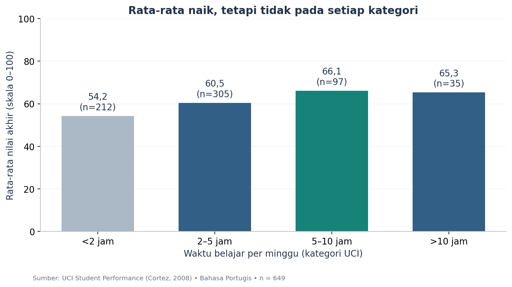
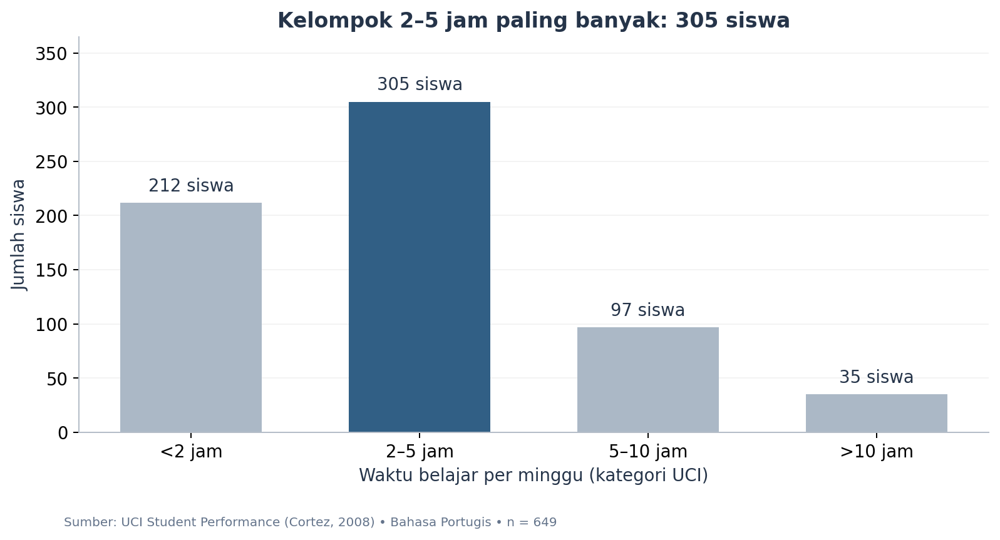

# Belajar Lebih Lama, Nilai Lebih Tinggi?

**EDA waktu belajar dan nilai akhir 649 siswa**  
Muhammad Fierlyan Irwandi · 3224600051  
Pengantar Kecerdasan Artifisial dan Pembelajaran Mesin · PENS

> Rata-rata nilai naik dari **54,2** pada kelompok <2 jam menjadi **66,1** pada kelompok 5–10 jam. Namun, kelompok >10 jam memiliki rata-rata **65,3**. Belajar lebih lama berkaitan dengan nilai lebih tinggi pada beberapa kelompok, tetapi durasi terpanjang tidak otomatis menghasilkan rata-rata tertinggi.



**Skala nilai 0–100 adalah nilai asli 0–20 dikali 5. Ini perbandingan deskriptif, bukan bukti sebab-akibat atau penetapan jam belajar ideal.**

## Mulai dari sini

- **[Notebook tugas](3224600051_Muhammad_Fierlyan_Irwandi_EDA.ipynb)** — kode, output, empat grafik, interpretasi, fitur–target, dan lima insight.
- **[Versi HTML](3224600051_Muhammad_Fierlyan_Irwandi_EDA.html)** — unduh lalu buka di browser; grafik tertanam.
- **[Catatan riset PDF](Belajar_dan_Nilai_Catatan_Riset.pdf)** — abstrak, metode, hasil, diskusi, keterbatasan, dan referensi.
- **[Naskah presentasi singkat](PRESENTASI_SINGKAT.md)** — satu grafik utama, sekitar dua menit, dilengkapi jawaban tanya jawab.
- **[Data analisis](data/processed/data_siswa.csv)** dan **[kamus data](docs/KAMUS_DATA.md)** — enam kolom yang mudah dipahami.

## Abstrak

Kajian ini mengeksplorasi hubungan kategori waktu belajar mingguan dengan nilai akhir pada 649 siswa mata pelajaran Bahasa Portugis dari dua sekolah di Portugal. Data berasal dari UCI Student Performance; seluruh baris dipertahankan. Nilai asli diskalakan secara linier ke 0–100. Rata-rata nilai pada empat kategori waktu belajar berturut-turut adalah 54,2; 60,5; 66,1; dan 65,3. Kategori terlama tidak memiliki rata-rata tertinggi, tetapi selisih dua kategori teratas kecil dan jumlah anggotanya berbeda. Pemeriksaan per sekolah serta skenario tanpa nilai nol tetap menunjukkan selisih positif antara kategori 5–10 jam dan <2 jam. Hasil merupakan pola observasional; tidak menetapkan durasi belajar optimal atau efek kausal.

Ini **catatan riset perkuliahan**, bukan artikel yang telah ditelaah sejawat. Analisis tidak melatih model prediksi.

## Pertanyaan penelitian

Apakah kelompok siswa yang belajar lebih lama memiliki rata-rata nilai akhir lebih tinggi?

Pertanyaan tambahan: seberapa banyak anggota setiap kelompok, bagaimana sebaran nilai, dan bagaimana hubungan nilai periode kedua dengan nilai akhir?

## Data dan metode

Sumber primer: [Cortez (2008), Student Performance, UCI](https://doi.org/10.24432/C5TG7T). File yang dipakai adalah `student-por.csv`: **649 baris dan 33 kolom mentah**, diperoleh dari laporan sekolah dan kuesioner. Analisis memilih enam kolom dan mempertahankan semua siswa. Dataset historis ini diunduh pada **18 September 2026**; tanggal unduh bukan tahun data dan hasil tidak mewakili kondisi Indonesia saat ini.

1. Periksa bentuk tabel, nilai kosong, duplikat identik, dan rentang nilai.
2. Petakan kode waktu belajar ke empat kategori sumber; kode 1–4 tidak dianggap sebagai jam pasti.
3. Kalikan G1, G2, G3 dengan 5 agar skala tampilan menjadi 0–100; tidak mengubah urutan atau korelasi.
4. Ringkas jumlah, rata-rata, median, dan sebaran; tampilkan histogram, diagram batang, dan scatter plot.
5. Periksa pola per sekolah serta skenario tanpa nilai nol sebagai pelengkap, bukan pengganti analisis utama.

Tidak ada nilai kosong atau duplikat identik pada seluruh kolom mentah. Sebanyak **15 nilai akhir nol tetap disertakan** karena berada dalam rentang sah; penyebabnya tidak diketahui. Tidak ada imputasi atau penghapusan outlier. File matematika tidak digabung agar siswa yang mengikuti dua mata pelajaran tidak dihitung ganda.

## Lima temuan

1. Kategori **2–5 jam** mencakup **305 siswa (47,0%)**, kelompok terbesar.
2. Rata-rata nilai akhir **59,5**, dengan median **60** pada skala tampilan 0–100.
3. Kategori **5–10 jam** memiliki rata-rata **66,1**, dibanding **54,2** pada <2 jam: selisih **11,9 poin**, bukan persen.
4. Kategori **>10 jam** memiliki rata-rata **65,3** dan hanya **35 siswa**; durasi terpanjang bukan rata-rata tertinggi pada sampel ini.
5. Korelasi nilai periode kedua dengan nilai akhir **r = 0,92**; angka ini bukan akurasi model 92%.



Grafik lain: [distribusi nilai](figures/01_distribusi_nilai.png) dan [nilai periode kedua versus nilai akhir](figures/04_nilai_sebelumnya.png).

## Diskusi dan keterbatasan

Rata-rata kelompok adalah ringkasan, bukan jaminan untuk individu. Perbedaan kemampuan awal, sekolah, dukungan belajar, dan faktor lain belum dikendalikan. Selisih 0,8 poin antara dua kategori teratas tidak diuji signifikansinya dan tidak membuktikan kelompok 5–10 jam lebih unggul atau belajar >10 jam merugikan.

Data berasal dari dua sekolah, satu mata pelajaran, dan periode historis. Durasi merupakan kategori kuesioner; jumlah siswa tiap kategori tidak sama. Kesimpulan tidak digeneralisasi ke semua siswa atau mahasiswa Indonesia.

Dalam konteks ML, target adalah nilai akhir. Contoh fitur: waktu belajar, nilai periode pertama, dan kedua **jika tersedia saat prediksi**. Prediksi pada awal tahun harus mengeluarkan nilai periode yang belum terbit. Absensi tidak dimasukkan ke contoh fitur karena waktu rekapnya belum jelas.

## Reproduksi

Lingkungan yang diuji: Python 3.13.1. Versi paket tersimpan di `requirements.txt`. Setelah dependensi dipasang, analisis memakai data lokal dan tidak memerlukan internet.

```bash
git clone https://github.com/feboyfierlyan/student-study-eda.git
cd student-study-eda
python3 -m venv .venv
source .venv/bin/activate
python -m pip install -r requirements.txt
python src/prepare_data.py
python -m unittest discover -s tests -v
python src/build_notebook.py
python jalankan_ulang.py
```

Di Windows, aktivasi lingkungan dengan `.venv\Scripts\activate`. `jalankan_ulang.py` memakai interpreter lingkungan aktif, menjalankan notebook dari awal, lalu mengekspor HTML dengan gambar tertanam.

Untuk membangun PDF setelah notebook dijalankan:

```bash
python -m pip install -r requirements-paper.txt
python src/build_paper.py
```

## Struktur

```text
data/raw/         CSV asli UCI dan dokumentasi variabel
data/processed/   Data enam kolom dan ringkasan analisis
data/provenance.json
figures/          Empat grafik PNG
src/              Persiapan data, pembangun notebook, pembangun paper
tests/            Pemeriksaan integritas, penskalaan, dan kategori
docs/             Kamus data dan hasil validasi
```

## Pemenuhan tugas

- [x] Dataset tabular minimal 100 baris: 649 siswa.
- [x] `head`, `shape`, `info`, dan `describe`.
- [x] Minimal tiga visualisasi: tersedia empat.
- [x] Identifikasi fitur dan target.
- [x] Lima insight singkat dan interpretasi grafik.
- [x] Nama file `3224600051_Muhammad_Fierlyan_Irwandi_EDA.ipynb` dan versi HTML.
- [x] Naskah presentasi singkat untuk batas tiga menit.

## Referensi, lisensi, dan sitasi

1. Cortez, P. (2008). *Student Performance* [Dataset]. UCI Machine Learning Repository. [DOI: 10.24432/C5TG7T](https://doi.org/10.24432/C5TG7T). Lisensi **CC BY 4.0**.
2. Cortez, P., & Silva, A. M. G. (2008). *Using Data Mining to Predict Secondary School Student Performance*. Studi pengantar pada [halaman UCI](https://archive.ics.uci.edu/dataset/320/student+performance).
3. Sigit, R. *Materi 04: Python dan Data Exploration untuk Machine Learning*. Instruksi tugas slide 22.

Kode Python asli berlisensi MIT. Data dan adaptasi berlisensi CC BY 4.0; lihat [DATA_LICENSE.md](DATA_LICENSE.md). Metadata proyek ada pada [CITATION.cff](CITATION.cff). Pemeriksaan hasil tercatat pada [docs/VALIDASI.md](docs/VALIDASI.md).

Versi **3.0** mengganti topik sebelumnya dengan pendidikan agar pertanyaan, data, dan presentasi lebih mudah dipahami. Riwayat revisi terdahulu tetap tersimpan di Git; isi utama saat ini sepenuhnya kajian waktu belajar dan nilai.
