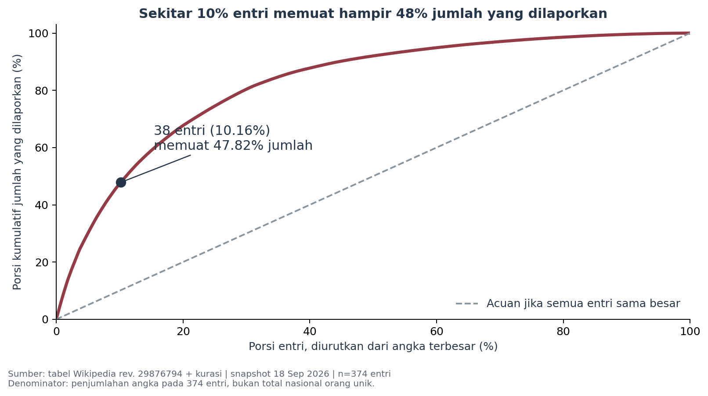
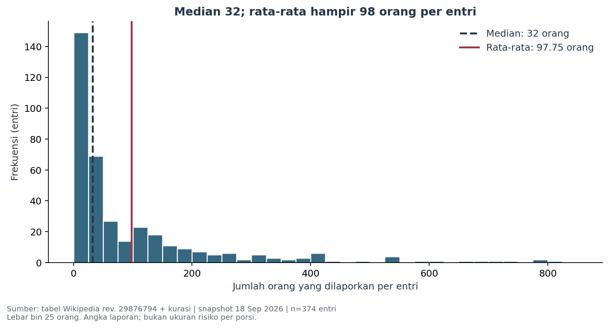

# MBG di Balik Angka Kasus

### Mengapa menghitung laporan saja tidak cukup?

**Catatan riset eksploratif · snapshot 18 September 2026 · versi 2.0**  
Muhammad Fierlyan Irwandi · 3224600051  
Teknik Komputer, Politeknik Elektronika Negeri Surabaya  
Pengantar Kecerdasan Artifisial dan Pembelajaran Mesin

> Pada **374 entri terpilih**, **38 entri terbesar (10,16%) memuat 47,82%** dari penjumlahan jumlah orang yang dilaporkan. Median **32**, rata-rata **97,75** orang per entri.

**Unit analisis adalah entri laporan publik, bukan orang unik, dapur, atau kejadian epidemiologis yang telah dideduplikasi. Angka di atas bukan estimasi nasional dan bukan risiko keracunan per porsi.**



## Abstrak

Kajian ini mengeksplorasi distribusi dan konsentrasi besaran laporan dugaan maupun kejadian keracunan yang dikaitkan dengan Makan Bergizi Gratis (MBG). Tabel Wikipedia versi tetap menghasilkan 419 entri yang menyertakan tautan rujukan dan teks sumber. Kurasi berbasis kejelasan angka, tanggal, dan rujukan menyisakan 374 entri untuk analisis utama. Distribusi miring ke kanan dan sebagian kecil entri memuat bagian besar dari penjumlahan angka. Pola tetap terlihat pada pemeriksaan kepekaan. Hasil mendukung pelaporan frekuensi bersama skala dampak, dengan keterbatasan seleksi media, ketidakseragaman unit laporan, dan ketiadaan denominator porsi makan.

Ini merupakan **tugas akademik berbentuk catatan riset**, bukan publikasi yang telah melalui telaah sejawat. Tidak ada model prediksi yang dilatih atau klaim kausal.

## Baca hasil

- **[Notebook pengumpulan](3224600051_Muhammad_Fierlyan_Irwandi_EDA.ipynb)** — kode, output, lima grafik, interpretasi, fitur–target, dan lima insight.
- **[HTML notebook](3224600051_Muhammad_Fierlyan_Irwandi_EDA.html)** — unduh dan buka di browser; gambar tertanam.
- **[Catatan riset PDF](MBG_Catatan_Riset.pdf)** — ringkasan bergaya paper dengan metode, hasil, diskusi, dan referensi.
- **[Presentasi sekitar 2–2,5 menit](PRESENTASI_SINGKAT.md)** — naskah langsung ke inti dan jawaban tanya jawab.
- **[Dataset CSV](data/processed/mbg_laporan.csv)** — semua 419 entri, termasuk yang dikeluarkan.
- **[Audit sumber](docs/AUDIT_SUMBER.md)** dan **[kamus data](docs/KAMUS_DATA.md)** — batas penggunaan dan keputusan kurasi.

## Pertanyaan penelitian

Seberapa beragam dan terkonsentrasi jumlah orang yang dilaporkan pada entri publik terkait keamanan pangan MBG? Apakah kesimpulannya berubah ketika entri besar atau aturan kurasi diubah?

Konteks terbaru: [BGN pada 15 September 2026](https://www.bgn.go.id/news/siaran-pers/bgn-siapkan-aplikasi-rating-mbg-sekolah-diminta-tak-segan-laporkan-sppg-bermasalah) menyampaikan rencana aplikasi penilaian layanan oleh sekolah. Informasi itu digunakan sebagai konteks transparansi, bukan sebagai penjelas kausal hasil.

## Data dan metode

Sumber: [Wikipedia, revisi 29876794](https://id.wikipedia.org/w/index.php?title=Daftar_kasus_keracunan_massal_makan_siang_gratis&oldid=29876794), bagian MBG, diperbarui 18 September 2026 pukul 04.19 UTC. Revisi terbaru dipilih untuk kemutakhiran; penyimpanan versi tetap tidak berarti isinya telah diverifikasi sepenuhnya.

- **419 entri** berasal dari blok referensi, bukan dari penggandaan baris sekolah pada sel gabungan.
- **374 entri utama**, bertanggal 13 Januari 2025–16 September 2026, memenuhi aturan angka literal, tanggal tunggal dalam periode kajian, dan rujukan spesifik tanpa konflik yang ditemukan.
- **45 entri dikeluarkan** dari statistik utama, tetapi tetap tersedia beserta alasannya.
- Kata “ratusan”, nilai kosong, perkiraan, dan batas numerik tidak diimputasi menjadi angka pasti.
- Audit manual bersifat terarah dan tidak mencakup verifikasi independen seluruh artikel.

**Transparansi audit:** sumber memuat sebuah entri 1.333 yang merangkum beberapa kejadian, rujukan salah lokasi, URL beranda tanpa artikel spesifik, dan tanggal 2024. Semua tetap dapat dilihat pada snapshot dan log; entri tersebut tidak dipakai untuk membesarkan temuan utama.

## Hasil utama

1. **Kurasi:** 45 dari 419 entri (10,74%) tidak memenuhi aturan analisis utama.
2. **Distribusi:** median 32 orang berbeda jauh dari mean 97,75 orang per entri.
3. **Konsentrasi:** 38 entri terbesar (10,16%) memuat 47,82% jumlah pada subset.
4. **Skala besar:** 115 entri dengan setidaknya 100 orang (30,75%) memuat 81,17% jumlah pada subset.
5. **Kepekaan:** setelah lima terbesar dikeluarkan, sekitar 10% entri terbesar yang tersisa masih memuat 44,82% jumlah.



Visualisasi tambahan: [sebaran waktu](figures/03_waktu.png), [sebaran provinsi](figures/04_provinsi.png), dan [alur kualitas data](figures/05_kualitas_data.png).

## Interpretasi dan batasan

Menghitung laporan saja menyamakan bobot entri yang berukuran kecil dan besar. Besaran per laporan perlu ditampilkan bersama frekuensi untuk memahami dampak yang tercatat.

Daftar ini tidak lengkap, bukan sampel acak, dan belum melakukan deduplikasi orang atau kejadian lintas entri. Dugaan dan konfirmasi belum dibedakan secara konsisten. Data tidak menyediakan jumlah porsi per wilayah dan waktu, sehingga tidak menghasilkan probabilitas keracunan, peringkat keamanan provinsi, atau evaluasi manfaat-risiko program secara keseluruhan. **Jangan membagi jumlah pada kajian ini dengan penerima nasional dari tanggal berbeda.**

Untuk konteks ML, kandidat X berupa provinsi, tahun, dan bulan; y berupa jumlah yang tercatat pada entri. Prediktor tersebut mungkin mencerminkan pola pelaporan. Dataset belum layak digunakan sebagai sistem prediksi operasional.

## Reproduksi

Lingkungan pengujian: Python 3.13.1. Paket dipatok di `requirements.txt`. Semua data untuk reproduksi tersedia lokal.

```bash
git clone https://github.com/feboyfierlyan/mbg-safety-eda.git
cd mbg-safety-eda
python3 -m venv .venv
source .venv/bin/activate
python -m pip install -r requirements.txt
python src/prepare_data.py
python -m unittest discover -s tests -v
python src/build_notebook.py
python jalankan_ulang.py
```

Pada Windows gunakan `.venv\Scripts\activate` untuk aktivasi. Skrip eksekusi memakai interpreter lingkungan aktif. `prepare_data.py` membaca snapshot yang disimpan, bukan halaman Wikipedia yang berubah setiap hari. Notebook memeriksa SHA-256 CSV. Skrip paper menggunakan dependensi tambahan pada `requirements-paper.txt`.

## Struktur repositori

```text
data/raw/        Snapshot HTML dan hasil ekstraksi dengan referensi
data/processed/  CSV, entri eksklusi, statistik dan sensitivitas
data/provenance.json
src/            Persiapan data dan pembangun notebook/paper
tests/          Pemeriksaan parsing, sel gabungan, serta integritas data
figures/        Lima grafik PNG
docs/           Audit sumber, kamus data, dan validasi
```

## Rubrik tugas

- [x] Minimal 100 baris data.
- [x] `head`, `shape`, `info`, dan `describe`.
- [x] Minimal tiga visualisasi; tersedia lima.
- [x] Identifikasi fitur dan target.
- [x] Lima insight beserta interpretasi.
- [x] File NIM_Nama_EDA.ipynb dan versi HTML.
- [x] Presentasi singkat, di bawah batas tiga menit pada kecepatan latihan yang disarankan.

## Sumber, lisensi, dan sitasi

Kontributor Wikipedia. *Daftar kasus keracunan massal makan siang gratis*, [revisi 29876794](https://id.wikipedia.org/w/index.php?title=Daftar_kasus_keracunan_massal_makan_siang_gratis&oldid=29876794). Diakses 18 September 2026. Snapshot dan adaptasi data berlisensi **CC BY-SA 4.0**, dengan atribusi dan perubahan didokumentasikan pada [DATA_LICENSE.md](DATA_LICENSE.md). Hak cipta artikel yang dirujuk tetap pada penerbitnya; isi penuh artikel tersebut tidak disalin ke repositori.

Kode Python asli berlisensi MIT. Untuk menyitir proyek ini gunakan metadata [CITATION.cff](CITATION.cff). Instruksi akademik mengacu pada materi Riyanto Sigit, *Materi 04: Python dan Data Exploration untuk Machine Learning*, slide 22.

Riwayat revisi: versi 2.0 menggantikan kajian Wine Quality dengan MBG. Riwayat versi sebelumnya tetap tersimpan di Git.
