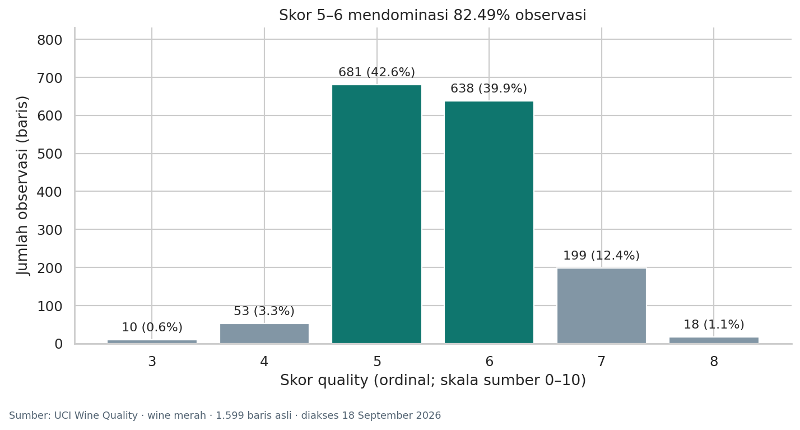
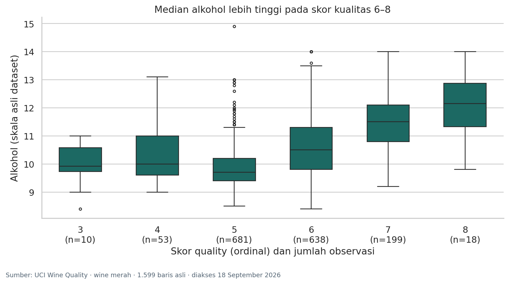

# EDA Wine Quality Merah

**Tugas mandiri Materi 04 — Pengantar Kecerdasan Artifisial dan Pembelajaran Mesin**  
Muhammad Fierlyan Irwandi · **3224600051**  
Teknik Komputer · Politeknik Elektronika Negeri Surabaya

Eksplorasi 1.599 catatan wine merah dari UCI untuk memahami distribusi skor kualitas, hubungan antarvariabel, serta keputusan yang perlu dipertimbangkan sebelum pemodelan.

## Buka tugas

- **[Notebook lengkap](3224600051_Muhammad_Fierlyan_Irwandi_EDA.ipynb)** — kode, output, lima grafik, interpretasi, dan lima insight. File utama untuk dikumpulkan.
- **[Versi HTML](3224600051_Muhammad_Fierlyan_Irwandi_EDA.html)** — unduh lalu buka di browser; grafik dan output tertanam sehingga dapat dibaca tanpa menjalankan Python.
- **[Naskah presentasi 3 menit](PRESENTASI_3_MENIT.md)** — alur bertanda waktu dan persiapan tanya jawab.

GitHub dapat menampilkan pratinjau notebook. Jika pratinjau gagal, unduh HTML melalui menu **Raw / Download raw file**, lalu buka secara lokal.

## Temuan utama

1. Tidak ada missing value, tetapi terdapat 240 baris identik tambahan (15,01%).
2. Skor kualitas 5–6 mendominasi 82,49% observasi.
3. Alkohol berkorelasi positif dengan kualitas (Pearson r = 0,476).
4. Keasaman volatil berkorelasi negatif dengan kualitas (r = −0,391).
5. Aturan IQR menandai 155 nilai gula residual (9,69%) sebagai kandidat outlier.





## Ruang lingkup dan keputusan

Analisis utama mempertahankan **1.599 baris asli**. Baris identik dan nilai ekstrem tidak otomatis dihapus. Sebagai pemeriksaan, analisis dengan 1.359 baris unik menghasilkan korelasi alkohol sebesar 0,480 dan keasaman volatil sebesar −0,395, serupa dengan data asli.

Sebelas pengukuran fisikokimia digunakan sebagai kandidat fitur `X`, sedangkan skor ordinal `quality` menjadi target `y`. Target tidak dimasukkan ke fitur. Tidak ada model yang dilatih atau klaim akurasi prediksi. Korelasi bersifat asosiasi, bukan bukti kausal.

## Kesesuaian dengan instruksi slide 22

- [x] Dataset tabular minimal 100 baris → 1.599 baris.
- [x] `head`, `shape`, `info`, `describe` → bagian 3 notebook.
- [x] Minimal tiga visualisasi → lima grafik pada bagian 5.
- [x] Identifikasi fitur dan target → bagian 6.
- [x] Lima insight singkat → bagian 8.
- [x] Interpretasi menyertai output → seluruh bagian analisis.
- [x] Nama file mengikuti `NIM_Nama_EDA.ipynb`.
- [x] Siap dipresentasikan 3 menit → naskah dan lampiran notebook.

## Menjalankan ulang

Notebook dan HTML sudah memuat output. Menjalankan ulang bersifat opsional.

Lingkungan yang digunakan: **Python 3.13.1**. Versi paket utama tercantum pada `requirements.txt`. Jalankan perintah berikut dari folder proyek:

```bash
python3 -m venv .venv
source .venv/bin/activate
python -m pip install -r requirements.txt
python jalankan_ulang.py
```

Pada Windows, ganti perintah aktivasi dengan `.venv\Scripts\activate`. Skrip menjalankan semua sel secara berurutan, menyimpan output notebook, dan membangun ulang HTML. Untuk mengedit interaktif, buka notebook dengan Jupyter atau VS Code lalu pilih kernel Python yang memiliki dependensi di atas.

CSV lokal tersedia di `data/`, sehingga eksekusi normal tidak membutuhkan unduhan dataset. Bila notebook dibuka sendirian, sel pemuatan menyediakan fallback unduhan resmi UCI. SHA-256 diperiksa sebelum analisis agar file yang dipakai konsisten.

## Isi arsip

```text
3224600051_Muhammad_Fierlyan_Irwandi_EDA.ipynb
3224600051_Muhammad_Fierlyan_Irwandi_EDA.html
PRESENTASI_3_MENIT.md
README.md
VALIDASI.md
requirements.txt
jalankan_ulang.py
hasil_ringkas.json
data/
  winequality-red.csv
  winequality.names
  SUMBER_DATA.md
figures/
  01_histogram_alcohol.png
  02_distribusi_quality.png
  03_boxplot_alcohol_quality.png
  04_scatter_alcohol_acidity.png
  05_heatmap_korelasi.png
```

## Sumber dan atribusi

Cortez, P., Cerdeira, A., Almeida, F., Matos, T., & Reis, J. (2009). *Wine Quality* [Dataset]. UCI Machine Learning Repository. [DOI: 10.24432/C56S3T](https://doi.org/10.24432/C56S3T). Lisensi dataset: [CC BY 4.0](https://creativecommons.org/licenses/by/4.0/).

Publikasi sumber: *Modeling wine preferences by data mining from physicochemical properties*. Decision Support Systems, 47(4), 547–553. [DOI: 10.1016/j.dss.2009.05.016](https://doi.org/10.1016/j.dss.2009.05.016).

Instruksi tugas mengacu pada materi Riyanto Sigit, *Materi 04: Python dan Data Exploration untuk Machine Learning*, terutama slide 22. File perkuliahan asli tidak disalin ke repositori; arsip ini berisi hasil pengerjaan tugas.
